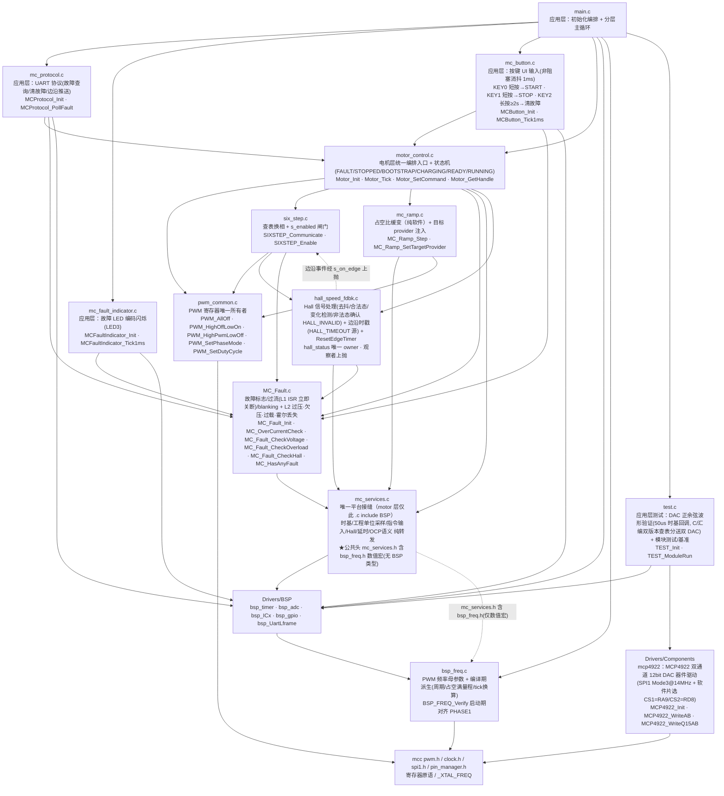
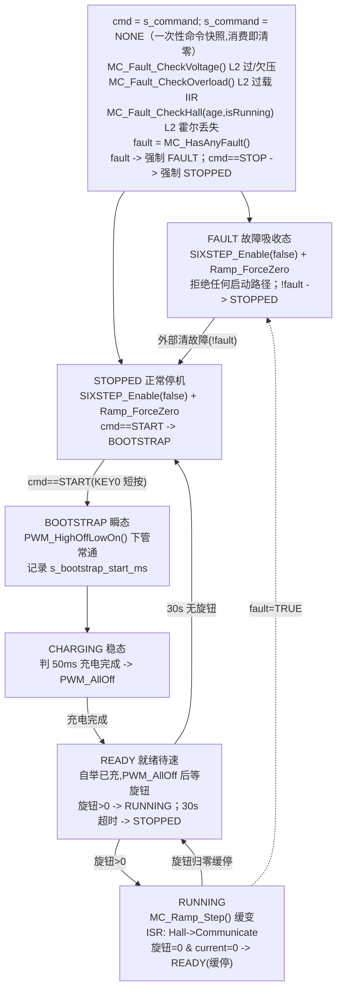
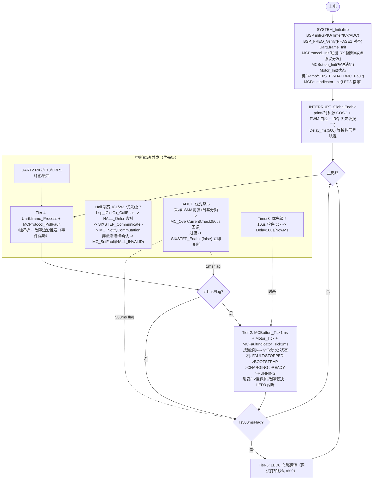

# 架构与流程

> 目标器件：dsPIC33EP128MC506 · 编译器 XC16 v2.10 · MPLAB X v6.05
> 设计基线：motor 层零 BSP include，`mc_services` 为唯一平台接缝。

## 一、分层依赖



**分层规则**

| 层 | 职责 | 允许的向下依赖 |
|---|---|---|
| 应用层 `main.c` | 初始化编排、分层主循环、调试打印(默认 `#if 0` 关) | motor 层 + BSP（应用层可直达 BSP） |
| 应用层辅助 `mc_protocol` / `mc_fault_indicator` / `mc_button` | UART 故障协议(查询/清除/边沿推送)、故障 LED 编码闪烁、按键 UI(短按启停/长按清故障) | motor 层(`Motor_SetCommand`/`Motor_GetHandle`/`MC_Fault`) + BSP（应用层可直达 BSP） |
| motor 层 `Middlewares/MotorControl/` | 电机控制策略与算法 | **只经 `mc_services`** 触达 BSP；例外：`pwm_common` 直接 include `mcc pwm.h`（它是 PWM 寄存器唯一 owner） |
| `mc_services`（接缝） | 平台服务门面，**纯转发** BSP | `Drivers/BSP`（motor 层仅此 **`.c`** 直接 include BSP 头） |
| `Drivers/BSP` | 纯硬件适配 + IC ISR 桥 + **工程单位换算** + **PWM 母参数派生(`bsp_freq`)** | `mcc_generated_files` |
| `mcc_generated_files` | MCC 生成外设驱动 | 寄存器 |

## 二、分层任务框架（Tier-0~4）

借 ST MCSDK "按时间常数分层" 的思想，但不照搬其"高频电流环"（本项目六步开环，无电流环）。

换相已是事件驱动（Hall 边沿 ISR），不占周期任务槽。

节拍源全部来自 **ADC ISR（与 PWM 硬件同步）**，

TMR3 仅作独立秒表（延时/时间戳）。

| 层 | 节拍 | 触发方式 | 执行内容 | 时基源 |
|---|---|---|---|---|
| **Tier-0** | 异步 | IC ISR（优先级 7） | Hall 去抖 + `SIXSTEP_Communicate` 换相 + `MC_NotifyCommutation` 记 blanking 时戳 + 边沿 ms 时戳 + 非法态(000/111)连续确认置 `HALL_INVALID` | 事件驱动 |
| **Tier-1** | 50μs (20kHz) | ADC ISR 回调（优先级 6） | ADC 采样 + SMA 滤波 + 时基分频 + **`MC_OverCurrentCheck` 瞬时过流判定 + ISR 内立即关 PWM** | ADC 50μs tick |
| **Tier-2** | 1ms | ADC ISR 置 flag，主循环消费 | **`MCButton_Tick1ms`** 按键消抖/事件分发 + **`Motor_Tick`** 状态机(消费一次性命令) + 缓变 + L2 慢保护(CheckVoltage/CheckOverload/CheckHall) + `MCFaultIndicator_Tick1ms` LED 闪烁 + 故障裁决 | ADC 1ms flag |
| **Tier-3** | 500ms | ADC ISR 置 flag，主循环消费 | 心跳 LED0（调试打印默认 `#if 0` 关） | ADC 500ms flag |
| **Tier-4** | 无固定 | 主循环每轮 | `UartLframe_Process` 帧解析 + `MCProtocol_PollFault` 故障边沿推送 | 事件驱动 |

**为什么过流用 ADC 时基而非 TMR3**：电流采样必须与 PWM 同步（采在计数器到顶/到底的稳定相位）。ADC 由 PWM 硬件触发，采到的是正确相位值；TMR3 与 PWM 不同步，可能采到开关瞬态尖峰误触发。TMR3 留作"测时间"的独立秒表（`MC_Delay10us` 关断裕量、`MC_GetTickMs` 时间戳），即便 ADC 故障停采，延时/计时仍准。

## 三、mc_services 平台接缝

motor 层唯一直接 include BSP 的文件（`mc_services.c`）。

公共头 `mc_services.h` 不暴露任何 BSP 类型/函数。

**单位换算（raw→mA/mV/duty）全部在 BSP 层完成，本层对 motor 层只暴露物理量与语义结果，纯转发**，与 `BSP_ADC_GetVbusMv` / `BSP_ADC_KnobToDuty` 同构。

| 门面 API | 转发至 | 用途 |
|---|---|---|
| `MC_GetTickMs()` | `BSP_Timer_NowMs()` | TMR3 1ms 自由运行时基（自举计时 / 缓变节拍），16-bit 回卷，消费方用差值 |
| `MC_GetTick50us()` | `BSP_ADC_TimeBase_GetTick50us()` | ADC 50μs 快时基（与 PWM 同步，供 blanking 判定），16-bit 回卷 |
| `MC_RegisterTick50us(cb)` | `BSP_ADC_TimeBase_Register50us(cb)` | 注册 50μs ADC ISR 回调（Tier-1 入口，如过流检测）。多槽共存（各 4 槽），仅初始化期注册，槽满 VERIFY 停机 |
| `MC_Delay10us(n)` | `BSP_Timer_Delay10us(n)` | 阻塞精确延时（MOSFET 关断裕量）；前置：全局中断已使能 |
| `MC_US_TO_PWM_TICKS(us)` | `BSP_US_TO_PWM_TICKS(us)` | 微秒->PWM tick 编译期换算宏（1 tick = 1 PWM 周期）；供 blanking 物理时长常量派生，仅限编译期入参 |
| `MC_GetCurrentIamA/IbmA/IcmA/IbusmA()` | `BSP_ADC_GetCurrentIaMa/IbMa/IcMa/IbusMa()` | 相/母线电流（mA，int16_t 有符号，已减 1.65V 偏置，0=无电流） |
| `MC_OC_Configure(threshold_mA)` | `BSP_ADC_OC_Configure(threshold_mA)` | 过流阈值下发（Init 期一次）：mA->raw 预计算存 BSP 静态变量；相/Ibus 共用同一阈值 |
| `MC_OC_IsPhaseOver()` / `MC_OC_IsIbusOver()` | `BSP_ADC_OC_IsPhaseOver()` / `BSP_ADC_OC_IsIbusOver()` | 过流判定（ISR 热路径）：仅 raw 与预计算常量比较，零运行时换算；相电流双向、Ibus 单向上限 |
| `MC_GetVbusMv()` | `BSP_ADC_GetVbusMv()` | 母线电压（mV），供慢保护 |
| `MC_GetKnobDuty()` | `BSP_ADC_KnobToDuty()` | 旋钮电位器 → 占空比指令（缓变目标值来源）；内部按 `BSP_DUTY_MIN/MAX` 限幅 |
| `MC_Hall_ReadStatus()` | `BSP_ICx_ReadHall()` | 读 3 路 Hall 引脚电平（bit2=U bit1=V bit0=W） |
| `MC_Hall_RegisterIsr(h)` | `BSP_ICx_RegisterIsrHandler(h)` | 注册 IC 边沿 ISR 统一处理函数 |

> `MC_OC_*` 是过流保护的语义接缝：motor 层只下发 mA 阈值 + 读 bool 结果，raw 换算/比较封装在 BSP。

## 四、工程单位换算与硬件标定

硬件标定参数分两处管理：

**电流/电压采样链路标定**（`ADC_CURRENT_*` / `VBUS_FACTOR`）归 `bsp_adc.h`；

**PWM 频率母参数及其派生**（`BSP_PWM_FREQUENCY_HZ` / `BSP_DUTY_FULLSCALE` / `BSP_TICKS_PER_MS` 等）归 `bsp_freq.h`。

换板子/换采样链路只改 BSP 一份，motor 层阈值不动。

**相电流链路（Ia/Ib/Ic）**：I(±3A) → Rsense(0.02Ω, ±60mV) → 运放(G=25.5, ±1.53V) → 加 1.65V 偏置 → ADC(0.12V~3.18V, 10-bit → raw 37~987)

**Ibus 母线电流链路**：I -> Rsense(0.02Ω) -> 运放(G=50, 无偏置) -> ADC（单极性，0A->raw≈0）。与相电流链路差异：G=50（非 25.5）、无 1.65V 偏置、单向（仅上限判定）。mA = raw × K_IBUS >> SHIFT，不减中点。

| 常量 | 值 | 含义 |
|---|---|---|
| `ADC_CURRENT_MIDPOINT` | 512 | 1.65V 对应的 raw 中点 |
| `ADC_CURRENT_K` | 3234 | 标定系数（raw 单边 475 ↔ 3000mA） |
| `ADC_CURRENT_SHIFT` | 9 | 移位数（÷512，相/Ibus 共用） |
| `ADC_CURRENT_K_IBUS` | 1650 | Ibus 标定系数（无偏置链路，G=50） |

换算实现：`bsp_adc.c` 的 static `RawToMa(raw)` —— 减偏置 → `abs` 取幅值 → `__builtin_muluu(mag, K) >> SHIFT`（dsPIC 单周期乘法）→ 恢复符号。另有 static `RawToMaIbus(raw)` -- 无偏置减中点步骤，直接 `__builtin_muluu(raw, K_IBUS) >> SHIFT`（单极性）。验证：raw=987 → +3000mA；raw=37 → -3000mA；raw=512 → 0。

**过流 raw 阈值预计算**（OCP 语义接缝的 BSP 侧）：`MC_OC_Configure(threshold_mA)` 调用时，BSP 用 `ADC_MA_TO_PHASE_RAWDELTA(mA)` / `ADC_MA_TO_IBUS_RAW(mA)`（编译期除法宏）把 mA 阈值反算为 raw 比较值，存静态变量。之后 ISR 热路径 `BSP_ADC_OC_IsPhaseOver` / `IsIbusOver` 仅做 raw 字面量比较（相电流双向 `|raw-512| > delta`，Ibus 单向 `raw > limit`），零运行时换算。未 Configure 前为安全态（永不越限）。

**PWM 频率母参数派生**（`bsp_freq.h`）：全工程只有 `BSP_PWM_FREQUENCY_HZ`（=20000）一个真值源，周期计数/占空满量程/tick 换算全部编译期 `#define` 派生。关键派生：`BSP_PWM_PERIOD_TICKS` = `_XTAL_FREQ / BSP_PWM_FREQUENCY_HZ` = 7000；`BSP_DUTY_FULLSCALE` = `BSP_PWM_PERIOD_TICKS`（=7000，即原 `KNOB_DUTY_FULLSCALE`，已更名迁址）；`BSP_DUTY_MIN/MAX` = 5%/95%（350/6650）；`BSP_TICKS_PER_MS` = 20；`BSP_US_TO_PWM_TICKS(us)` 微秒换算。`BSP_FREQ_Verify()` 启动期断言 MCC 写入的 `PHASE1` == `BSP_PWM_PERIOD_TICKS`，不一致则 VERIFY 死循环。

## 五、状态机流转（Motor_Tick 每 1ms 执行）



- **命令模型**（对齐 ST MCSDK DirectCommand）：应用层（按键 `mc_button` / 协议）经 `Motor_SetCommand(cmd)` 下发一次性命令（`MOTOR_CMD_START`/`STOP`），`Motor_Tick` 每拍开头快照 `s_command` 后立即清零——状态机不写回命令，重启须显式再次下发 START（故障清除/READY 超时 re-arm 后无电平残留）。命令在前置分流阶段消费：`cmd==STOP` 硬停→STOPPED（集中预分流，避免 switch 各 case 重复处理 STOP）；`cmd==START` 仅在 STOPPED case 内响应。
- 任意运行态（BOOTSTRAP/CHARGING/READY/RUNNING）+ fault → 当拍即进 **FAULT 吸收态**（`Motor_Tick` 开头前置分流，优先级高于命令）。前置的三步 L2 慢保护（`MC_Fault_CheckVoltage` 过/欠压 + `MC_Fault_CheckOverload` 过载 IIR + `MC_Fault_CheckHall` 霍尔信号丢失，仅 RUNNING 态生效）在读 `MC_HasAnyFault` 之前运行，可能本拍置标志，由紧随的 fault 前置分流当拍接管。`CheckHall` 的 `hall_age` 经 `HALL_MsSinceLastEdge()` 传入，避免 `MC_Fault` 反向依赖 hall 模块（保持 `MC_Fault → mc_services → BSP` 单向）。
- **FAULT 是吸收态**：进入后仅响应"清故障"事件，旋钮再大也不重启。`!fault` 时由 FAULT case 内部转出 → STOPPED（下拍再判启动命令），避免清故障瞬间高压启动。运行期清除途径：协议命令 `MC_ClearAllFaults` 或 KEY2 长按≥2s（`mc_button`）。
- **新增 READY 待速态**：`BOOTSTRAP_CHARGE_MS = 50`（`motor_control.h`）充电完成后 CHARGING 先 `PWM_AllOff()` 进入 READY（本拍只负责关断所有 MOS，结束自举充电）；READY 态若旋钮>0，则 `HALL_ResetEdgeTimer()` + `SIXSTEP_Enable(true)` → RUNNING。**关断裕量由"CHARGING→READY→RUNNING 跨拍"天然提供**（至少 1ms，远大于原 `MC_Delay10us(50)`=500μs），故已删除该阻塞延时，避免在 1ms 控制环内引入 500μs 阻塞抖动；同时把 HALL_TIMEOUT 窗口从"进入运行"起算，避免长时停机后旧时戳导致首个 RUNNING 拍误报。`READY_TIMEOUT_MS = 30000`（30s 无人给旋钮则回 STOPPED，关自举充电节能）。RUNNING 旋钮归零缓停后回 READY 待速（区别于 KEY1 硬停彻底回 STOPPED）。

## 六、故障管理与保护（MC_Fault）

**两级故障响应**（对齐 ST MCSDK 的 FAULT_NOW/FAULT_OVER 分层，缺硬件 BRK，由 L1 软件快保护兜底）：

| 级别 | 触发者 | 响应动作 | 延迟 | 适用故障 |
|---|---|---|---|---|
| **L1 软件快保护** | `MC_OverCurrentCheck`（50μs ADC ISR） | ① `MC_SetFault` 置标志 ② **`SIXSTEP_Enable(false)` ISR 内立即硬关 PWM** | ≤50μs | 过流（瞬时短路） |
| **L2 状态机** | `Motor_Tick`（1ms） | 读 `MC_HasAnyFault` → 转 **FAULT 吸收态** → 保持停机（前置 CheckVoltage/CheckOverload/CheckHall 置标志） | ≤1ms | 慢故障（过压/欠压/过载/霍尔丢失）+ 锁存语义 |

> 过流要求 μs 级响应（短路时 MOS 电流可达几十~上百 A，1ms 足以烧穿），故 L1 不等状态机，在 ISR 内立即 `SIXSTEP_Enable(false)`。状态机 L2 负责"故障后保持 FAULT 态 + 拒绝重启"的锁存语义。
>
> **特例：`HALL_INVALID`（霍尔非法态 000/111）** 在 Hall IC ISR（优先级 7，Tier-0）内由 `HALL_UpdateInputState` 连续确认 3 次后 `MC_SetFault` 置标志，但**不在 ISR 内立即关 PWM**——关断交状态机 FAULT 态（ms 级）。即"ISR 检测 / L2 响应"：检测快于 L2（不依赖 1ms 节拍），但响应不抢 L1 的 μs 级（信号卡死属慢过程，无需瞬时关断）。

**全锁存策略**（L2 状态机，避免持续短路时反复重启打嗝烧 MOS）：

```
ISR 置位 ─► s_fault_flags != 0 ─► Motor_Tick 读 fault=true
                                     ↓
                          强制 FAULT 态，但【不清零】
                                     ↓
              旋钮再大也不启动（!fault = false）
                                     ↓
     唯一清除途径：MC_Fault_Init（冷启动）/ 外部协议命令 / KEY2 长按≥2s（MC_ClearAllFaults）
```

| API | 调用方 | 职责 |
|---|---|---|
| `MC_Fault_Init` | `Motor_Init` | 清标志（冷启动干净态）+ `MC_OC_Configure(OC_THRESHOLD_MA)` 下发过流阈值 + 经 `MC_RegisterTick50us` 自注册过流回调 |
| `MC_OverCurrentCheck` | 50μs ISR 回调（Tier-1） | blanking 期内跳过；否则经 `MC_OC_IsPhaseOver`/`MC_OC_IsIbusOver`（raw 与预计算常量比较，零换算）判定，超限 `SIXSTEP_Enable(false)` + `MC_SetFault` |
| `MC_Fault_CheckVoltage` | `Motor_Tick`（Tier-2，1ms） | 读 `flt_vbus`（滤波值），超 `OV_THRESHOLD_MV` 置 `OVER_VOLTAGE`，低于 `UV_THRESHOLD_MV` 置 `UNDER_VOLTAGE`；只置标志，关断交状态机 FAULT 态 |
| `MC_Fault_CheckOverload` | `Motor_Tick`（Tier-2，1ms） | 对 `MC_GetCurrentIbusmA` 做一阶 IIR 低通（τ≈128ms），超 `OVERLOAD_THRESHOLD_MA` 置 `OVERLOAD`；只置标志，交状态机 FAULT 态（与瞬时过流互补：堵转电流可能不超瞬时阈值却持续发热） |
| `MC_Fault_CheckHall(age,running)` | `Motor_Tick`（Tier-2，1ms） | 仅 RUNNING 态：`hall_age_ms`（由调用方经 `HALL_MsSinceLastEdge()` 传入）超 `HALL_TIMEOUT_MS` 置 `HALL_TIMEOUT`；只置标志，交状态机 FAULT 态。与 `HALL_INVALID`（ISR 内检测三线卡死 000/111）互补：本项捕获运行中信号丢失/堵转 |
| `MC_NotifyCommutation` | `SIXSTEP_Communicate` | 记换相时戳，启动 blanking 屏蔽期 |
| `MC_HasAnyFault` / `MC_GetFault` | `Motor_Tick`（Tier-2） | 读标志（只读不清） |
| `MC_ClearAllFaults` | 外部协议命令 / KEY2 长按(`mc_button`) | 唯一运行期全清点 |
| `MC_ClearFault(f)` | 外部协议命令 | 单位清除（按位清，用于精确清某类故障） |

**故障类型**（`MC_Fault_e` 位图，可并发记录多重故障）：`OVER_CURRENT`(bit0) / `OVER_VOLTAGE`(bit1) / `UNDER_VOLTAGE`(bit2) / `OVERLOAD`(bit3) / `HALL_INVALID`(bit4) / `HALL_TIMEOUT`(bit5) / `OVER_TEMP`(bit6)。`HALL_INVALID`/`HALL_TIMEOUT` 为新增霍尔保护位；`OVER_TEMP` 位已预留（暂无温度采样驱动）。`s_fault_flags` 为 `volatile uint16_t`。纯读/整字写（`MC_HasAnyFault`/`MC_GetFault`/`MC_ClearAllFaults`）为 16 位原子操作；`MC_SetFault`/`MC_ClearFault` 的按位读-改-写非原子，已用 `SET_AND_SAVE_CPU_IPL(7)` 关中断临界区保护（主循环/ADC ISR pri6/Hall ISR pri7 多写方并发安全，保存恢复式可重入）。

**Blanking 屏蔽期**：换相后 `MC_BLANKING_US=150`（物理时长，与 PWM 频率解耦）内跳过过流检测，避免六步换相电流尖峰误触发。`BLANKING_TICKS` 由 `MC_US_TO_PWM_TICKS(MC_BLANKING_US)` 编译期派生（20kHz 下 = 3 个 50μs 周期）；改 PWM 频率时物理时长不变，tick 数自动重算。时戳源 = ADC 50μs tick；Hall ISR（优先级 7）写、ADC ISR（优先级 6）读，优先级差保证无竞态。

**保护参数**（占位，需台架实测）：
- 过流（L1 ISR，μs 级）：`OC_THRESHOLD_MA=2500`（±2.5A，满量程 ±3A 留线性区裕量）
- 过/欠压（L2 状态机，ms 级）：`OV_THRESHOLD_MV=32000`（32V，24V 系统 +33% 裕量）/ `UV_THRESHOLD_MV=18000`（18V，24V 系统 -25% 裕量）
- 过载（L2 状态机，ms 级）：`OVERLOAD_THRESHOLD_MA=1500`（持续 1.5A，占位按电机额定调）/ `OVERLOAD_IIR_SHIFT=7`（τ≈128ms）
- 霍尔信号丢失（L2 状态机，ms 级）：`HALL_TIMEOUT_MS=500`（运行中 500ms 无合法边沿，占位按最低工作转速调）；`HALL_INVALID` 连续确认次数 `HALL_INVALID_CONFIRM_N=3`（定义于 `hall_speed_fdbk.c`）
- Blanking 屏蔽：`MC_BLANKING_US=150`（物理时长）-> `BLANKING_TICKS` 派生 = 3（20kHz 下）

> 以上常量集中定义于 `MC_Fault.c`（模块私有 `#define`）；`BLANKING_TICKS` 经 `MC_US_TO_PWM_TICKS`（源自 `bsp_freq.h`）编译期派生；电流链路标定（`ADC_CURRENT_*`）归 `bsp_adc.h`。

## 七、PWMC 原语 ↔ 硬件状态

`pwm_common.c` 是 PWM Override 寄存器唯一所有者；所有上层（6-step 换相 / 自举充电 / 紧急下电）必须经 `PWM_SetPhaseMode` 访问。写入顺序：先 OVRDAT 再切 OVREN，避免换相瞬间直通毛刺。

| 函数 | 枚举 | OVRENH | OVRDATH | OVRENL | OVRDATL | 含义 |
|---|---|:---:|:---:|:---:|:---:|---|
| `PWM_AllOff` | `PWM_HOFF_LOFF` | 1 | 0 | 1 | 0 | 6 管全关（停机/故障） |
| `PWM_HighOffLowOn` | `PWM_HOFF_LON` | 1 | 0 | 1 | 1 | 下管常通（自举充电） |
| `PWM_HighPwmLowOff` | `PWM_HPWM_LOFF` | 0 | 0(无效) | 1 | 0 | 上桥 PWM/下桥关（运行基底，每次换相按相覆盖） |

> 另有 `PWM_SetDutyCycle(duty)`：三相同步写 PDC1/2/3（纯寄存器操作，不维护软件影子），由 `mc_ramp` 缓变调用 + `MC_Ramp_ForceZero` 归零。它与上表三原语同属 `pwm_common`，是占空比写入的唯一入口。

## 八、Hall 换相调用链（ISR 驱动）

边沿中断自底层 BSP 向上触发，经接缝到信号处理层，再以观察者回调下发给换相层：

```
硬件 Hall 边沿
 └─ MCC ic1/2/3.c ISR（弱符号 ICx_CallBack）
    └─ bsp_ICx.c  IC1/2/3_CallBack()       强覆盖，底层入口；s_isr 为 NULL 时 no-op
       └─ s_isr()  ==  HALL_OnIsr
          └─ hall_speed_fdbk.c  HALL_OnIsr()
              ├─ HALL_UpdateInputState()       信号处理（去抖/合法态/变化检测/非法态确认 HALL_INVALID）
             ├─ s_last_edge_tick_ms = NowMs() 记边沿时戳（供测速/堵转检测）
             └─ s_on_edge(hall_status)
                └─ six_step.c  SIXSTEP_OnHallEdge()
                   └─ SIXSTEP_Communicate()
                      ├─ PWM_SetPhaseMode ×3       经 pwm_common 写 Override 寄存器
                      └─ MC_NotifyCommutation()    通知 fault 模块启动 blanking
```

`HALL_UpdateInputState()` 承担四项邻居无法接手的职责：

| 职责 | 说明 |
|---|---|
| 去抖 | 连续 3 次读一致才接受（防御窄毛刺） |
| 合法态校验 + 非法态确认 | 丢弃 000/111（BLDC 仅 1~6 合法）；去抖通过后仍为 0/7 视为一次"非法事件"，连续 `HALL_INVALID_CONFIRM_N=3` 次才 `MC_SetFault(HALL_INVALID)`（抗换相瞬间短促噪声），任意合法读即重置计数 |
| 变化检测 | 值未变 = 虚假中断，丢弃 |
| hall_status 缓存 | 唯一 owner，供 motor_control/six_step/main 读取 |

**DIP 解耦**：`six_step.c` 在 `SIXSTEP_Init` 注册 `SIXSTEP_OnHallEdge`；`hall_speed_fdbk` 不依赖 `six_step`（不知道 drive 是谁）。`HALL_Init` 还做冷启动种子读取，避免电机静止时 `hall_status=0`（非法）导致启动走全关态。

**速度环预留**：`HALL_GetSpeedRpm()`（占位返回 0）+ `HALL_MsSinceLastEdge()`（基于边沿时戳差）供未来 Tier-2 速度 PI 消费。`HALL_MsSinceLastEdge()` 当前已被 `MC_Fault_CheckHall`（HALL_TIMEOUT 检测）消费；`HALL_ResetEdgeTimer()` 在进入 RUNNING 态前重置计时基准，避免长时停机后重启误报。

> 引脚电平读取经 `MC_Hall_ReadStatus → BSP_ICx_ReadHall`（宏 `_RG8/_RG7/_RG6`，BSP 私有）；ISR 强覆盖归属 `bsp_ICx`，motor 层不碰 MCC 弱符号。

## 九、整体运行（分层主循环 + ISR 并发）



**中断优先级**（`interrupt_manager.c`）：

| 中断 | 优先级 | 用途 |
|---|:---:|---|
| IC1 / IC2 / IC3 | 7 | Hall 边沿捕捉 → 换相 + blanking 时戳 |
| AD1 | 6 | ADC 采样 + 软件时基（50us/1ms/500ms）+ 过流回调 |
| T3 | 5 | 10μs 软件 tick（`BSP_Timer_*` 延时/时间戳） |
| U2TX / U2RX / U2E | 3 / 2 / 1 | UART2 协议帧收发 |
| PWM1 | 未配置（MCC默认为4） | PWM Special Event 中断未使用（时基 = ADC ISR） |

**ISR 时序注意**：`Motor_Init` 内的 `HALL_Init` 在 `INTERRUPT_GlobalEnable` 之前执行并注册 `HALL_OnIsr`（顺序：SIXSTEP_Init 先注册 s_on_edge，再 HALL_Init 注册 IC ISR，最后 MC_Fault_Init 注册过流回调）。全部回调注册完成才开中断。

**调试**：`main.c` 的 500ms 调试打印块当前用 `#if 0` 关闭（保留代码，开启即可用），分两行输出：

① `Vbus(mV) Ia Ib Ic Ibus(mA)`（Vbus 直调 `BSP_ADC_GetVbusMv`，电流经 `MC_GetCurrentI*mA` 接缝）；

② `state fault hall 6step target_duty/current_duty age_ms`（经 `Motor_GetHandle` 统一句柄）。

开中断后还有一次性 printf（常开）：时钟源 COSC + 系统时钟/指令时钟 + IRQ 优先级报告 + PWM 自检（PHASE1 vs 派生值/频率/占空满量程），并以 `assert(PHASE1 == BSP_PWM_PERIOD_TICKS)` 兜底。

## 十、速度环接缝（预留，未实现）

当前 RUNNING 态：`旋钮(MC_GetKnobDuty) → Ramp → PWM`，开环。

未来加速度闭环时，只需：
1. 实现 `HALL_GetSpeedRpm()`（基于 `s_last_edge_tick_ms` 边沿时戳差 + 极对数）。
2. 实现速度 PI 调节器，输出占空比。
3. 调 `MC_Ramp_SetTargetProvider(speedPiOutput)` 热切换目标来源。

`MC_Ramp_Step` 内部 `s_ramp.target_duty = s_target_provider()` 。经 provider提供占空比来源，默认指 `MC_GetKnobDuty`，切换无需改 Ramp 代码。

## 十一、工程文件结构说明

```
Hello_MCC.X/
├── main.c                      初始化mcc配置的外设->初始化Drivers中所有外设->应用初始化->分层主循环
├── mc_protocol.c / .h          应用层：UART 故障协议(查询/清除/边沿推送 FAULT_NOTIFY)；注册 RX 回调替代回声
├── mc_fault_indicator.c / .h   应用层：故障 LED 编码闪烁(LED3)，闪 N 次=bit(N-1)，1ms 非阻塞状态机
├── mc_button.c / .h            应用层：按键 UI 输入(非阻塞消抖 1ms)；KEY0 短按→START / KEY1 短按→STOP / KEY2 长按≥2s→清故障
├── test.c / .h                 应用层测试：DAC 正余弦波形验证(50us 时基) + 模块测试/基准(自 main.c 迁移)
├── user_manager.h              全局段(section)/RAM 宏 + 中断优先级获取宏 + VERIFY 自检
├── Architecture.md             本架构文档
├── Makefile  /  nbproject/     MPLAB X 工程构建配置（Makefile 由 nbproject 派生）
├── Hello_MCC.mc3               MCC 配置文件
├── mcc-manifest-*.yml          MCC 生成清单（autosave / generated-success）
├── defmplabxtrace.log*         MPLAB X 追踪日志
│
├── Linker/
│   └── p33EP128MC506.gld       链接器脚本：程序段/数据段/.core_section/.bsp_section 等定位
│
├── mcc_generated_files/        ① MCC 自动生成外设驱动（寄存器原语，勿手改）
│   ├── mcc.c / mcc.h           SYSTEM_Initialize 统一入口
│   ├── system.c / system.h     外设总初始化 + 开全局中断
│   ├── clock.c / clock.h       系统时钟（外部晶振 + PLL → Fosc=140MHz, FCY=70MHz）
│   ├── interrupt_manager.c/.h  中断优先级配置（IC=7 / AD1=6 / T3=5 / U2TX=3 / U2RX=2 / U2E=1）
│   ├── pin_manager.c / .h      引脚总览、GPIO 初始化、PPS 重映射
│   ├── pwm.c / pwm.h           PWM 波形生成（含 Override 寄存器访问原语）
│   ├── adc1.c / adc1.h         ADC 驱动（PWM 触发，BUF0~BUF3）
│   ├── uart2.c / uart2.h       UART2 + printf 重定向
│   ├── ic1.c / ic2.c / ic3.c   输入捕捉（ICx_CallBack 为弱符号，被 BSP 强覆盖）
│   ├── tmr3.c / tmr3.h         Timer3（10μs 软件 tick 源）
│   ├── cvr.c / cvr.h           比较器参考电压
│   ├── reset.c / reset.h       复位源管理
│   ├── traps.c / traps.h       陷阱（trap）处理
│   ├── watchdog.h              看门狗
│   ├── *_types.h               类型定义（reset_types.h / system_types.h）
│   ├── *_features.h            模块特性配置（adc_module_features.h / pwm_module_features.h）
│   └── where_was_i.s           汇编桩（复位/异常现场记录）
│
├── Drivers/                    ② 硬件适配层
│   ├── BSP/                    板级支持包（工程单位换算在此完成）
│   │   ├── bsp_gpio.c / .h     LED/KEY 数组化配置管理 + GPIO 操作 API
│   │   ├── bsp_adc.c / .h      ADC ISR + 时基(50us/1ms/500ms) + raw→mA/mV/duty 换算
│   │   │                        CH0 轮询 3 通道(slot0/1/2=AN3 Vbus/AN4 Knob/AN6 Ibus)，CH1~3 常驻(Ia/Ib/Ic)；标定常量 ADC_CURRENT_*/VBUS_FACTOR
│   │   ├── bsp_freq.c / .h      ★PWM 频率母参数(BSP_PWM_FREQUENCY_HZ) + 编译期派生(周期/占空满量程/tick换算)
│   │   │                        BSP_FREQ_Verify 启动期对齐 PHASE1；BSP_DUTY_FULLSCALE/MIN/MAX 也在此
│   │   ├── bsp_ICx.c / .h      IC 硬件初始化(GPIO/PPS/ICxCON/IEC) + Hall 读取 + IC ISR 桥
│   │   ├── bsp_timer.c / .h    基于 TMR3 的 10μs tick → Delay10us/DelayMs/NowMs 时间戳
│   │   ├── bsp_UartLframe.c/.h UART 轻量帧协议（帧头 AA55+LEN+DATA+校验和，轮询解析）
│   │   └── delay.s / delay.h   汇编忙等延时（基于指令周期，不依赖中断，上电阶段可用）
│   ├── Components/             器件驱动（外接功能芯片，只依赖 MCC 生成原语）
│   │   └── mcp4922.c / .h     MCP4922 双通道 12bit DAC：16bit 命令字(高4位配置) + 软件片选时序
│   │                            SPI1(SDO1=RA4/SCK1=RC3 专用脚, Mode3@14MHz)；CS1=RA9→DAC1, CS2=RD8→DAC2, LDAC 接地
│   │                            MCP4922_Q15To12：Q1.15(-32768~32767)→12bit 偏置二进制(0~4095, 0→VREF/2)
│   └── support_dsPIC33E/       器件支持头（寄存器位域定义）
│       ├── p33EP128MC506.h
│       └── p33EP128MC506.inc
│
└── Middlewares/
    └── MotorControl/           ③ 电机控制策略层（motor 层，零 BSP include）
        ├── motor_control.c/.h  统一编排入口 + 状态机(FAULT/STOPPED/BOOTSTRAP/CHARGING/READY/RUNNING)：Motor_Init / Motor_Tick(1ms) / Motor_SetCommand(一次性命令 START/STOP) / Motor_GetHandle
        ├── mc_services.c / .h  ★平台接缝：motor 层唯一直接 include BSP 的 .c；.h 含 bsp_freq.h 数值宏；纯转发 + OCP 语义接缝
        ├── mc_ramp.c / .h      占空比缓变（纯软件策略 + 目标 provider 注入，速度环接缝）
        ├── six_step.c / .h     六步换相查表 + s_enabled 软件闸门（Hall ISR 内执行）
        ├── pwm_common.c / .h   PWM Override 寄存器唯一所有者（例外：直接 include mcc pwm.h）
        ├── hall_speed_fdbk.c/.h Hall 信号处理（去抖/合法态/变化检测/非法态确认 HALL_INVALID）+ 边沿时戳 + ResetEdgeTimer + 观察者上抛
        └── MC_Fault.c / .h     故障管理：L1 过流(50us ISR,raw 比较) + L2 过/欠压/过载/霍尔丢失(1ms) + blanking 屏蔽
```

**分层归属速查**：

| 目录 | 层 | 可向下依赖 | 是否可手改 |
|---|---|---|---|
| `mcc_generated_files/` | 寄存器原语 | 寄存器 | ✗ MCC 重新生成会覆盖 |
| `Drivers/BSP/` | 硬件适配 | `mcc_generated_files` | ✓（自行维护） |
| `Drivers/Components/` | 器件驱动 | `mcc_generated_files`（经 SPI1/GPIO 原语） | ✓ |
| `Middlewares/MotorControl/` | 电机策略 | 仅 `mc_services`（例外：`pwm_common`→`mcc pwm.h`） | ✓ |
| `main.c` + 根目录 `mc_protocol`/`mc_fault_indicator`/`mc_button`/`test` | 应用层 | motor 层 + BSP + Components（应用层可直达） | ✓ |

> `build/` `debug/` `dist/` `.generated_files/` 为构建产物，不入版本管理关注范围。

## 十二、开发注意事项

**1. 必须使用官方 C 运行时启动模块（crt0）**
若替换或缺省官方启动模块，会出现：
- `printf` 卡死（标准 IO 未初始化，`write()` 重定向在 `uart2.c:321` 的 `.libc.write` 段，依赖 libc 初始化）。
- 类似 `TRISE` 等寄存器按地址访问卡死（SFR 区映射未建立）。
→ 链接器脚本 `Linker/p33EP128MC506.gld` 已正确指定启动模块路径，勿擅自修改启动段。

**2. 断言 / 自检机制**
- 标准 `<assert.h>` 的 `assert`：定义 `NDEBUG` 时会被预处理删除（仅调试期生效，发布版失效）。
- 本工程运行期自检改用 `user_manager.h` 的 `VERIFY(cond)`：失败即 `while(1){}` 死循环，**不受 NDEBUG 影响**，便于调试器原地捕获。

**3. 中断关闭期间禁用 `printf`**
`main.c` 在 `INTERRUPT_GlobalDisable()` 与 `INTERRUPT_GlobalEnable()` 之间执行 BSP 初始化，此区间禁止 `printf`（UART TX 中断未开，会陷入阻塞等待）。

**4. PWM 频率与占空比换算绑定**
旋钮→占空比映射以 PWM 周期为满量程：`BSP_DUTY_FULLSCALE = _XTAL_FREQ / BSP_PWM_FREQUENCY_HZ`（当前 140MHz / 20kHz = 7000），定义于 `bsp_freq.h`。

改 PWM 载波频率时只需改 `bsp_freq.h` 的 `BSP_PWM_FREQUENCY_HZ` 母宏，所有派生自动重算；`BSP_FREQ_Verify()` 启动期断言 MCC `PHASE1` 与派生值一致，若忘了同步则死循环。

## 十三、演进路径

| 阶段 | 验证项目 | 关键结论 / 沉淀 | 当前对应模块 |
|---|---|---|---|
| PWM 基础 | Independent_Edge_OnlyPWMxH | 独立时基模式：PWMxH 出 PWM、PWMxL 出低电平（边沿对齐非互补） | `pwm_common`（H-PWM / L-OFF 基底） |
| PWM 基础 | Independent_Center_ComplementPWM | 死区公式：`ALTDTRx = Fosc × 死区时间 / 预分频`；互补模式死区由 ALTDTRx 配置 | PWM 死区配置（MCC 侧） |
| 时基建立 | PWM1_Trig_ADC | PWM 比较事件触发 ADC 结束采样；**ADC ISR 即系统时基源**（每 PWM 周期一次 = 20kHz = 50μs） | `bsp_adc` 时基 |
| 采样链路 | Knob_To_Duty | ① ADC 与 PWM 同频 ② CH0 轮询 `{AN3, AN4, AN6}` ③ 旋钮 raw→占空比 ④ Vbus 用 SMA 滤波 | `bsp_adc` / `mc_services` |
| 控制策略 | Ramp_Duty | 占空比缓变（防过冲）+ 停机/运行状态机编排 | `mc_ramp` / `motor_control` |
| 硬件时序 | Self_Priming_CAP_Charging | ① TMR3 每 10μs 触发 → 阻塞式 Delay10us/DelayMs ② 下管常通 50ms 给自举电容预充电 | 状态机 BOOTSTRAP/CHARGING + `bsp_timer` |
| 换相算法 | 6-Step | Hall 信号 → 查表六步换相（H-PWM / L-ON 方案） | `six_step` + `hall_speed_fdbk` |
| 故障保护 | Hall_Invalid_Timeout | 霍尔双重保护：`HALL_INVALID`（ISR 内连续确认 000/111）+ `HALL_TIMEOUT`（L2 运行中信号丢失 500ms） | `hall_speed_fdbk` / `MC_Fault` |
| 故障通信/可视化 | Fault_Protocol_Indicator | UART 推(边沿 FAULT_NOTIFY)+拉(查询)混合 + 现场无串口时 LED3 编码闪烁（闪 N 次=bit(N-1)） | `mc_protocol` / `mc_fault_indicator` |
| UI 输入/命令模型 | Button_Cmd_Model | 按键 UI(短按启停/长按清故障) + DirectCommand 一次性命令(状态机消费即清零)；新增 READY 待速态(自举充完后等旋钮,30s 超时停机) | `mc_button` / `motor_control` |

**演进中确立的关键设计决策**：

- **ADC 必须与 PWM 同步采样**：电流须采在计数器到顶/到底的稳定相位；故 ADC 由 PWM 硬件触发，过流检测走 ADC ISR 而非独立定时器（见 §二"为什么过流用 ADC 时基"）。
- **CH0 轮询、CH1~3 常驻**：相电流 Ia/Ib/Ic（AN0/1/2 → CH1/2/3 → BUF1/2/3）每个 PWM 周期都采（过流检测要实时值，不滤波）；Vbus/Knob/Ibus 共用 CH0 分时轮询（slot 0/1/2 = AN3/AN4/AN6），慢变量做 SMA 滤波。见 `bsp_adc.c:s_ch0AnMap`、`ADC_Data_t`。
- **TMR3 与 ADC 职责分离**：TMR3 作"测时间"的独立秒表（阻塞延时、ms 时间戳），不参与控制节拍；即便 ADC 故障停采，延时/计时仍准。
- **自举充电时序**：进入运行态前下管常通 `BOOTSTRAP_CHARGE_MS=50ms` → `PWM_AllOff`（CHARGING 末拍）→ 进入 **READY 态**跨拍等旋钮 → 旋钮>0 时交还上桥 override + 使能换相。关断裕量由"CHARGING→READY→RUNNING 跨拍"天然提供（≥1ms），替代了原 `MC_Delay10us(50)` 阻塞延时。

- **PWM 频率母参数集中**（`bsp_freq.h`）：全工程只有 `BSP_PWM_FREQUENCY_HZ` 一个自由度，周期计数/占空满量程/tick 换算全部编译期 `#define` 派生，零运行时开销。`BSP_FREQ_Verify()` 启动期断言 MCC 写入的 `PHASE1` == 派生值，杜绝"改了 MCC GUI 频率/PLL 却忘了同步代码"的静默失准。
- **过流 raw 比较封装在 BSP**（OCP 语义接缝）：motor 层经 `MC_OC_Configure(mA)` 下发阈值（Init 期一次 mA->raw 反算），ISR 热路径 `MC_OC_Is*` 仅做 raw 字面量比较，零运行时换算。motor 层只见 mA/bool，不感知 raw/标定常量。
- **过载 IIR 慢保护**（`MC_Fault_CheckOverload`）：对 Ibus 做一阶 IIR 低通（τ≈128ms），与瞬时过流（μs 级）互补 -- 堵转电流可能不超瞬时阈值却持续发热烧 MOS。超 `OVERLOAD_THRESHOLD_MA` 置 `OVERLOAD` 故障。
- **Blanking 物理时长解耦**：`MC_BLANKING_US=150`（μs）经 `MC_US_TO_PWM_TICKS` 编译期派生为 tick 数，改 PWM 频率时屏蔽期物理时长不变。
- **霍尔双重保护**：`HALL_INVALID`（Hall ISR 内对 000/111 连续确认 N=3 次置标志，抗换相瞬态噪声；ISR 检测/L2 响应）与 `HALL_TIMEOUT`（L2 状态机，仅 RUNNING 态，`HALL_MsSinceLastEdge` 超 500ms）互补——前者捕获三线卡死/断线，后者捕获运行中信号丢失/堵转。`CheckHall` 的 age 由调用方传入，保持 `MC_Fault → mc_services → BSP` 单向依赖。
- **故障可视化/通信双通道**（应用层辅助模块）：`mc_protocol` 提供 UART 推(边沿 `FAULT_NOTIFY`)+拉(查询 `FAULT_RESP`)混合模型 + 清故障命令；`mc_fault_indicator` 为"无串口现场操作员"提供 LED3 编码闪烁（闪 N 次 = bit(N-1)，多重故障按位序轮播）。两者均仅主循环调用，`UartLframe_Send` 最坏阻塞 50ms 故严禁进 1ms 控制环。
- **命令驱动启动 + READY 待速态**（对齐 ST MCSDK DirectCommand）：启动须显式 `MOTOR_CMD_START`（KEY0 短按/协议），不再"旋钮>0 即自启"，避免上电旋钮未归零意外启动。新增 READY 态解耦"自举完成"与"等旋钮"：CHARGING 充完即 `PWM_AllOff` 进 READY，旋钮到位才使能换相；同时把原 `MC_Delay10us(50)` 阻塞关断裕量替换为"跨拍天然裕量"（CHARGING→READY→RUNNING 至少隔 1ms），消除 1ms 控制环内的 500μs 阻塞抖动。`mc_button` 与 `mc_protocol` 同为应用层命令源，经 `Motor_SetCommand` 单一接缝下发，状态机每拍快照后清零消费（末写胜，无电平残留）。
